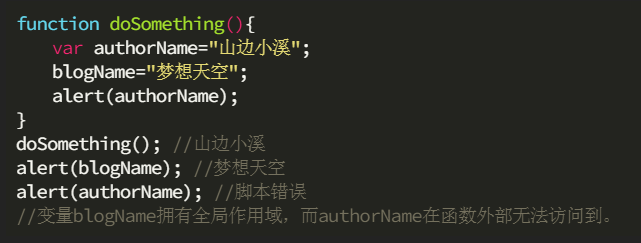
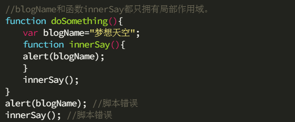

# 函数

## 什么是函数?

> 函数就是执行指定功能的代码段

```javascript
function helloWorld() {
    console.log("hello world !!!");
}

helloWorld(); // 输出helloWorld
```

## 函数的命名规范

-   动词+名词
-   命名规范和变量一致
    1. 区分大小写
    2. 不能数字开头
    3. 不能保留字
    4. 不能空格

## 如何定义一个函数

```javascript
function 函数名(参数) {
    代码段;
}
```

```javascript
var 函数名 = function(参数) {
    代码段;
};
```

```javascript
// plusNumber() = a+b
function plusNumber() {
    var a = 1;
    var b = 2;
    return a + b;
}
```

```javascript
// plusNumber() = a+b
var plusNumber = function() {
    var a = 1;
    var b = 2;
    return a + b;
};
```

## 函数的运行, 需要调用

```javascript
// 单纯定义是没有结果的
function helloWorld() {
    console.log("hello world !!!");
}
```

## 什么是函数的参数？

> 函数的参数可以分为两种
1. 实参 ：实参是调用函数时传入的参数
2. 形参 ：形参是定义函数时传入的参数
- 参数的个数问题
    1. 实参个数比形参多时,多的实参自动忽略
    2. 形参个数比实参多时,少的实参都按照undefined处理


```javascript
function printSomething(sth) {
    console.log(sth);
}

printSomething("hello world"); // hello world
printSomething("hello USA"); // hello USA
```

## 什么是函数的返回值?


> 返回函数运行的结果

 ### 1. 没有返回值的情况

```javascript
function plusNumber() {
    var a = 1;
    var b = 2;
    console.log(a + b);
}

plusNumber(); // 3
```

### 2. 没有返回值会返回 `undefined`

```javascript
function plusNumber() {
    var a = 1;
    var b = 2;
    // console.log(a+b);
    a + b;
}

plusNumber(); // 3
console.log(plusNumber()); // undefined
```

### 函数和返回值的关系, 相当于变量和变量值的关系

```javascript
// plusNumber() = a+b
function plusNumber() {
    var a = 1;
    var b = 2;
    return a + b;
}

console.log(plusNumber()); // 3
```

### 返回值需要被变量接收

```javascript
function plusNumber() {
    var a = 1;
    var b = 2;
    return a + b;
}

plusNumber(); // 没有结果
```

```javascript
function plusNumber() {
    var a = 1;
    var b = 2;
    return a + b;
}
var result = plusNumber();
console.log(plusNumber()); // 3
```


## 作用域
> 作用域就是变量与函数的可访问范围，即作用域控制着变量与函数的可见性和生命周期。在JavaScript中，变量的作用域有全局作用域和局部作用域两种。
1. 全局作用域
    - 在代码中任何地方都能访问到的对象拥有全局作用域，一般来说以下几种情形拥有全局作用域
        - 最外层函数和在最外层函数外定义的变量拥有全局作用域
        - 所有末定义直接赋值(没有var关键字)的变量自动声明为拥有全局作用域
        - 所有window对象的属性拥有全局作用域



2. 局部作用域
        - 和全局作用域相反，局部作用域一般只在固定的代码片段内可访问到，最常见的的就是在函数内部，所以也会看到有人把这种作用域称为函数作用域
        - 函数体内的变量声明（var声明的变量）会提前到函数体顶部，同时变量初始化还在原来位置（变量提升）


```javascript
//几个案例
//1.如果全局变量的名字和局部变量的名字一样 优先使用局部变量
var scope;
scope="global"
function t(){
    console.log(scope);//undefined
    var scope="local"
    console.log(scope);//local
}
t();
//-------------------------------------------
//2.
var name="global";
if(true){
  var name="local";
  console.log(name) //local
}
console.log(name);//local
//-------------------------------------------
//3.
function test() {  
  a = 30; 
  var b = 20;
}
test();
console.log("a="+a);//30
console.log("b="+b);//报错
//-------------------------------------------
//4.
var a;
function fun() { 
  a = "global"; 
}
console.log(a);//undefined

```
