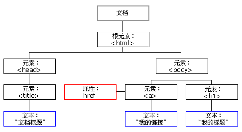

# DOM节点

**在 HTML DOM 中，所有事物都是节点。DOM 是被视为节点树的 HTML。**

****

### DOM 节点

根据 W3C 的 HTML DOM 标准，HTML 文档中的所有内容都是节点：
+ 整个文档是一个文档节点
+ 每个 HTML 元素是元素节点
+ HTML 元素内的文本是文本节点
+ 每个 HTML 属性是属性节点
+ 注释是注释节点

****

### HTML DOM 节点树

HTML DOM 将 HTML 文档视作树结构。这种结构被称为节点树：

**HTML DOM Tree 实例**



通过 HTML DOM，树中的所有节点均可通过 JavaScript 进行访问。所有 HTML 元素（节点）均可被修改，也可以创建或删除节点。

****

**父节点、子节点和同胞节点**

节点树中的节点彼此拥有层级关系。

父（parent）、子（child）和同胞（sibling）等术语用于描述这些关系。父节点拥有子节点。同级的子节点被称为同胞（兄弟或姐妹）。

+ 在节点树中，顶端节点被称为根（root）
+ 每个节点都有父节点、除了根（它没有父节点）
+ 一个节点可拥有任意数量的子
+ 同胞是拥有相同父节点的节点
+ 下面的图片展示了节点树的一部分，以及节点之间的关系：


我们可以通过代码来更详细的看节点之间的关系

```

<html>
  <head>
    <title>DOM 教程</title>
  </head>
  <body>
    <h1>DOM 第一课</h1>
    <p>Hello world!</p>
  </body>
</html>

```

从上面的 HTML 中：

+ \<html> 节点没有父节点；它是根节点
+ \<head> 和 \<body> 的父节点是 \<html> 节点
+ 文本节点 "Hello world!" 的父节点是 \<p> 节点

并且：

+ \<html> 节点拥有两个子节点：\<head> 和 \<body>
+ \<head> 节点拥有一个子节点：\<title> 节点
+ \<title> 节点也拥有一个子节点：文本节点 "DOM 教程"
+ \<h1> 和 \<p> 节点是同胞节点，同时也是 \<body> 的子节点

并且：

+ \<head> 元素是 \<html> 元素的首个子节点
+ \<body> 元素是 \<html> 元素的最后一个子节点
+ \<h1> 元素是 \<body> 元素的首个子节点
+ \<p> 元素是 \<body> 元素的最后一个子节点

****


# 节点访问

### 访问 HTML 元素（节点）

访问 HTML 元素等同于访问节点，我们可以通过很多方法访问节点，下面是三种常用的方式：

+ 通过使用 getElementById() 方法
+ 通过使用 getElementsByTagName() 方法
+ 通过使用 getElementsByClassName() 方法

**getElementById() 方法**

getElementById() 方法返回带有指定 ID 的元素：

**语法**

```
node.getElementById("id");
```

下面的例子获取 id="intro" 的元素：
**实例**
```
document.getElementById("intro");
```

**getElementsByTagName() 方法**

getElementsByTagName() 返回带有指定标签名的所有元素。

**语法**

```
node.getElementsByTagName("tagname");
```

下面的例子返回包含文档中所有 \<p> 元素的列表：
**实例1**
```
document.getElementsByTagName("p");
```


下面的例子返回包含文档中所有 \<p> 元素的列表，并且这些 \<p> 元素应该是 id="main" 的元素的后代（子、孙等等）：


**实例2**
```
document.getElementById("main").getElementsByTagName("p");
```

**getElementsByClassName() 方法**

getElementsByClassName() 方法返回带有指定 Class 的元素列表

如果您希望查找带有相同类名的所有 HTML 元素，请使用这个方法：

```
document.getElementsByClassName("intro");
```
上面的例子返回包含 class="intro" 的所有元素的一个列表：

注释：getElementsByClassName() 在 Internet Explorer 5,6,7,8 中无效。

----

# DOM 属性和方法

## 编程接口

可通过 JavaScript （以及其他编程语言）对 HTML DOM 进行访问。

所有 HTML 元素被定义为对象，而编程接口则是对象方法和对象属性。

方法是我们能够执行的动作（比如添加或修改元素）。

属性是我们能够获取或设置的值（比如节点的名称或内容）。

----
### HTML DOM 属性

属性是节点（HTML 元素）的值，我们能够获取或设置

一些常用的 HTML DOM 属性：

+ innerHTML - 节点（元素）的文本值
+ parentNode - 节点（元素）的父节点
+ childNodes - 节点（元素）的子节点
+ attributes - 节点（元素）的属性节点

----

#### innerHTML 属性

获取元素内容的最简单方法是使用 innerHTML 属性。

innerHTML 属性对于获取或替换 HTML 元素的内容很有用。

**实例**

下面的代码获取 id="intro" 的 \<p> 元素的 innerHTML：

```
<html>
<body>

<p id="intro">Hello World!</p>

<script>
var txt=document.getElementById("intro").innerHTML;
document.write(txt);
</script>

</body>
</html>

```

innerHTML 属性可用于获取或改变任意 HTML 元素，包括 \<html> 和 \<body>。

----

#### nodeName 属性

nodeName 属性规定节点的名称。

+ nodeName 是只读的
+ 元素节点的 nodeName 与标签名相同
+ 属性节点的 nodeName 与属性名相同
+ 文本节点的 nodeName 始终是 #text
+ 文档节点的 nodeName 始终是 #document

**注释**：nodeName 始终包含 HTML 元素的大写字母标签名。

----

#### nodeValue 属性

nodeValue 属性规定节点的值。

+ 元素节点的 nodeValue 是 undefined 或 null
+ 文本节点的 nodeValue 是文本本身
+ 属性节点的 nodeValue 是属性值


----

#### nodeType 属性

nodeType 属性返回节点的类型。nodeType 是只读的。

比较重要的节点类型有：

|元素类型| nodeType|
|:--|:---|
|元素|1|
|属性|2|
|文本|3|
|注释|8|
|文档|9|

----

###HTML DOM 方法

方法是我们可以在节点（HTML 元素）上执行的动作。

一些常用的 HTML DOM 方法：

|方法名|描述|
|:--|:--|
|getElementById() |返回带有指定 ID 的元素。|
|getElementsByTagName() |返回包含带有指定标签名称的所有元素的节点列表（集合/节点数组）。|
|getElementsByClassName() |返回包含带有指定类名的所有元素的节点列表。|
|appendChild() |把新的子节点添加到指定节点。|
|removeChild() |删除子节点。|
|replaceChild() |替换子节点。|
|insertBefore() |在指定的子节点前面插入新的子节点。|
|createAttribute() |创建属性节点。|
|createElement() |创建元素节点。|
|createTextNode() |创建文本节点。
|getAttribute() |返回指定的属性值。|
|setAttribute() |把指定属性设置或修改为指定的值。|