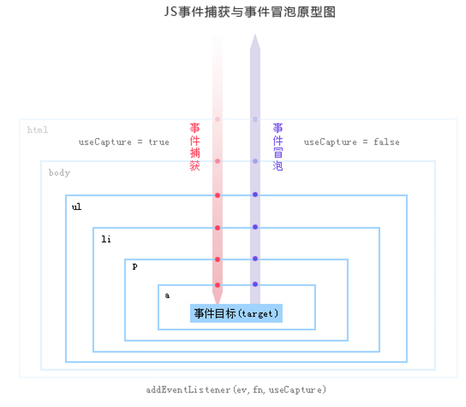

# js事件流

DOM(文档对象模型)结构是一个树型结构，当一个HTML元素产生一个事件时，该事件会在元素节点与根结点之间的路径传播，路径所经过的结点都会收到该事件，这个传播过程可称为DOM事件流。

## 浏览器处理DOM事件的过程

+ 对于事件的捕获和处理，不同的浏览器厂商有不同的处理机制
+ 这里我们主要介绍w3c对DOM2.0定义的标准事件
+ DOM2.0模型将事件处理流程分为3个阶段：

    1. 捕获阶段：事件从Document节点自上而下向目标节点传播的阶段；
    2. 目标阶段：真正的目标节点正在处理事件的阶段；
    3. 冒泡阶段：事件从目标节点自上而下向Document节点传播的阶段。

**捕获事件流**

事件的处理将从DOM层次的根开始，而不是从触发事件的目标元素开始，事件被从目标元素的所有祖先元素依次往下传递。在这个过程中，事件会被从文档根到事件目标元素之间各个继承派生的元素所捕获，如果事件监听器在被注册时设置了useCapture属性为true,那么它们可以被分派给这期间的任何元素以对事件做出处理；否则，事件会被接着传递给派生元素路径上的下一元素，直至目标元素。事件到达目标元素后，它会接着通过DOM节点再进行冒泡。

**目标阶段**

当到达元素目标后，执行与目标元素绑定的处理函数，如果没有绑定就不会执行

**冒泡事件流**

当事件在某一DOM元素被触发时，例如用户在客户名字节点上点击鼠标，事件将跟随着该节点继承自的各个父节点冒泡穿过整个的DOM节点层次，直到它遇到依附有该事件类型处理器的节点，此时，该事件是onclick事件。在冒泡过程中的任何时候都可以终止事件的冒泡，在遵从W3C标准的浏览器里可以通过调用事件对象上的stopPropagation()方法，在Internet Explorer里可以通过设置事件对象的cancelBubble属性为true。如果不停止事件的传播，事件将一直通过DOM冒泡直至到达文档根。

----

