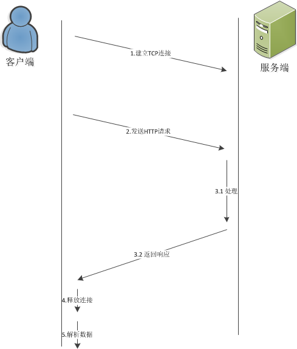

# http基础
## 1 HTTP介绍
HTTP协议（HyperText Transfer Protocol，超文本传输协议）是用于从WWW服务器传输超文本到本地浏览器的传送协议。
它的发展是万维网协会（World Wide Web Consortium）和Internet工作小组IETF（Internet Engineering Task Force）合作的结果。
它可以使浏览器更加高效，使网络传输减少。它不仅保证计算机正确快速地传输超文本文档，还确定传输文档中的哪一部分，以及哪部分内容首先显示(如文本先于图形)等。
### 1.1 版本
最常用的是HTTP1.0/1.1
最新版本是HTTP2.0，与1.0/1.1相比，有了更高的性能、安全性和灵活性
以前的版本0.9等
## 2 HTTP协议
### 2.1 URL与资源
#### 2.1.1 方案的世界
在TCP/IP模型中，所有的网络连接都要使用方案，方案定义使用什么协议，比如http、ftp、telnet

一个标准的网络请求包括:

<scheme>://<user>:<password>@<host>:<port>/<path>;<params>?<query>#<frag>
但在实际使用过程中，对于不同协议可以缺少某些信息，比如

ftp://192.168.169.121
http://www.baidu.com/index.html
对于http协议，主要的包括scheme(协议)、host(主机)和path(资源路径)
#### 2.1.2 URI、URL和URN
URI:统一资源标识符，包括URL和URN
URL:统一资源标识符，比如http://www.baidu.com/index.html就是一个URL
URN:统一资源名，它是无关物理位置的资源名定义，例子urn:ieft:rfc:2141
..html
**目前URN处于试验阶段，实际应用还很困难，在没有特别说明时，一般我们说的URI就代表URL**
..html

#### 2.1.3 媒体类型
在HTTP中，不管是word文件、js文件或者图片都是资源，通可以通过URL进行请求，但每种不同的文件都要进行区分，以便服务端和客户端进行正确处理，比如播放声音、显示文字。
因此，HTTP仔细地给每种要通过http请求响应传输的对象都打上名为MIME类型的数据格式标签。

MIME: Multipurpose Internet Mail Extension 多用途因特网邮件扩展
最开始是为了解决电子邮件系统之间的问题，后来用于定义更多类型的多谋体内容。常见的MIME：

html：text/html
Ascii: text/plain
Json:text/json
Jpg:image/jpeg
Gif:image/gif
Ppt: application/vnd.ms-powerpoint
Quicktime:video/quicktime

### 2.2 协议介绍
#### 2.2.1 协议栈

HTTP是基于TCP/IP的应用，因此HTTP无须关心网络寻址、数据传输和拓扑结构

#### 2.2.2 协议工作流程
在HTTP1.0/1.1中，HTTP采用请求响应模型来处理HTTP事务 HTTP事务有一条请求命令和一个响应结果组成，它们通过HTTP报文进行数据传输

**注意：请求是从客户端发往服务端，而响应是从服务端发回客户端**

**HTTP的工作过程**

-（1）客户端连接到Web服务器
-（2）发送HTTP请求
-（3）服务器接受请求并返回HTTP响应
-（4）释放连接TCP连接
-（5）客户端浏览器解析HTML内容

## 3 HTTP报文
### 3.1 报文
HTTP1.0/1.1报文由三部分组成：起始行、首部以及可选、包含数据的主体
**其中起始行和首部是由行分隔的ASCII文本**
主体是一个可选的数据块，主体中可以包含文本也可以包含二进制数据，也可以为空，与首部通过空一行进行区分

请求报文的格式：

<method> <request-url> <version>
<headers>

<entity-body>
响应报文的格式：

<version> <status> <reason-phrase>
<headers>

<entity-body>

具体例子：

#### 3.1.1 起始行
所有的HTTP报文都以一个起始行做为开始
请求报文：<method> <request-url> <version>   说明要做什么
响应报文：<version> <status> <reason-phrase>  说明结果怎样
-method，包括GET/POST/DELETE等等
-version，目前绝大多数都是1.0或者1.1
-status，表示做的结果
-reason-phrase，是对状态结果的进一步补充说明

#### 3.1.2 首部字段
HTTP首部字段向请求和响应报文中添加了一些附加信息，是一系列 key-value的列表,比如Content-Type:image/jpeg 表示类型是jpeg图片
首部的分类包括

通用首部：在请求和响应中都出现的信息
请求首部：只在请求报文中出现的信息
响应首部：只在响应报文中出现的信息
实体首部：描述主题的长度、内容等的信息
扩展首部：在HTTP规范中没有定义的其他信息

#### 3.1.3 实体
HTTP实体是HTTP报文的负荷，是HTTP要传输的数据内容。
### 3.2 方法
HTTP基本的方法包括：GET/POST/HEAD/PUT/TRACE/OPTIONS，用来告诉服务端要做什么操作
#### 3.2.1 GET
GET是最常用的方法，通常用于请求服务器发送某个资源

#### 3.2.2 POST
POST是常用的方法之一，用于向服务端提交数据，有主体

#### 3.2.3 HEAD
与GET类似，但在响应中只有首部，不返回具体数据，可以用来查看资源是否存在

#### 3.2.4 PUT/TRACE/OPTIONS/DELETE
PUT:用于向服务端写入文档
TRACE:用于跟踪某个请求
OPTIONS:用于查询服务端支持的方法
DELETE:用于删除服务端某个资源
#### 3.2.5 其他扩展方法
HTTP在设计之初就被设计成可扩展的，这样就可以适应新的特性。
扩展方法是在HTTP规范中没有定义的方法，它们有特别的用处，但需要服务端进行实现：
LOCK：锁定某个资源
COPY：拷贝某个资源
MOVE：移动某个资源
### 3.3 状态码
状态码是响应报文中对请求所做事情的处理结果，以方便客户端处理响应数据
状态码分为五大类：

信息性状态码：100~199
成功状态码：200~299
重定向状态码：300~399
客户端错误状态码：400~499
服务端错误状态码：500~599
#### 3.3.1 信息性状态码
HTTP1.1引入的状态码，目前存在一些争议
100-Continue：说明收到了请求的初始部分，请客户端继续
101-Switching Protocols：说明服务端正在根据客户端的指定，将协议转换成Update首部所列的协议
#### 3.3.2 成功状态码
客户端发起的请求大部分是成功，但成功也有不同的区别，所以用一组状态来区分不同的信息
-200-OK:没有任何问题
-201-Created:对于像PUT方法的响应，表示服务端创建了对象的请求
-202-Accepted:请求已经被接受，但未执行任何动作，服务端不保证会完成这个请求
-203-Non-Authoritative Information:实体首部包含的信息不是来自源端服务器，可能来自中间服务器，因此没有进行验证
-204-No Content:没有主体部分
-205-Reset Content:告诉浏览器清除当前页中的所有html元素
-206-Partial Content:成功执行了部分请求
#### 3.3.3 重定向状态码
重定向状态码告诉客户端使用替代请求来访问资源，或者返回一个请求以便客户端使用这个请求访问所需资源
主要的状态码：

-302-Found:客户端使用Location首部给出的URL来访临时访问资源
-304-Not Modified:标识请求的内容没有改变，可以使用缓存数据
#### 3.3.4 客户端错误状态码
客户端错误状态码标识客户端发送了一些错误的信息给服务端
比如：

-403-Forbidden：请求被服务端拒绝了，有可能是没有权限访问，也有可能是用户名密码错误
-414-Request URI Too Long:请求的URL太长了
#### 3.3.5 服务端错误状态码
标识服务端自身错误
比如：

-503-Service Unavailable：服务端暂时无法提供服务，可能因为服务端启动配置错误
-505-HTTP Version Not Supported:服务端接收到了它无法支持的协议版本，不能处理
### 3.4 首部
首部和方法配合工作，共同决定了客户端和服务端能做什么事情
主要包括：通用首部、请求首部、响应首部、实体首部
#### 3.4.1 通用首部
通用首部是提供了报文的最基本信息，不论报文的类型，都为其提供一些有用信息

如上图的Connection就是通用首部，在请求和响应报文中提供了连接的相关信息

-通用性的首部还包括：Date、MIME-Version、Via、Update等等
-HTTP1.0引入了一个允许HTTP应用程序缓存对象副本的首部——Cache-Control，叫做通用缓存首部
### 3.4.2 请求首部
请求首部只在请求报文中出现，用于辅助说明谁在发送请求，请求来自何处等等

比如：

-Host:请求主机名和端口号
-User-Agent:告诉服务端发起请求的应用程序的名称
### 3.4.3 响应首部
响应首部只在响应报文中出现，用于说明客户端应该怎么去处理的一些额外信息

比如：

-Expires:该资源的过期时间
-Server:服务器应用程序软件的名称和版本
#### 3.4.4 实体首部
实体首部用于标识实体的信息

比如:

-Content-Type:内容的类型
-Content-Length:内容的长度
https://www.cnblogs.com/TomSnail/p/6078395.html