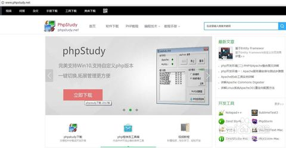
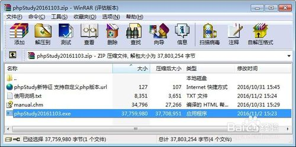
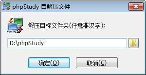
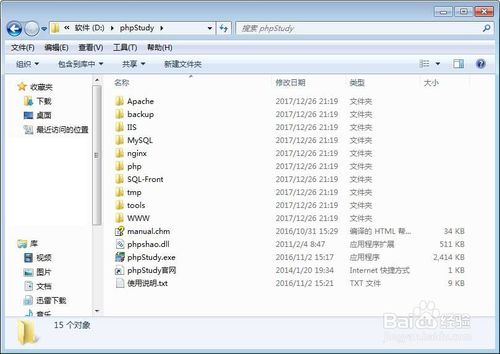
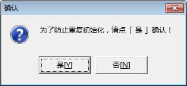
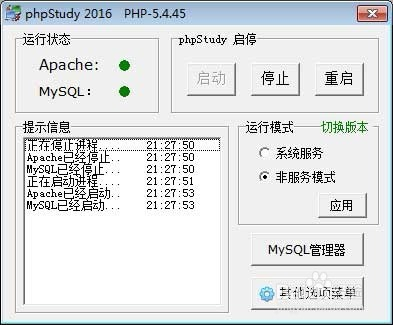
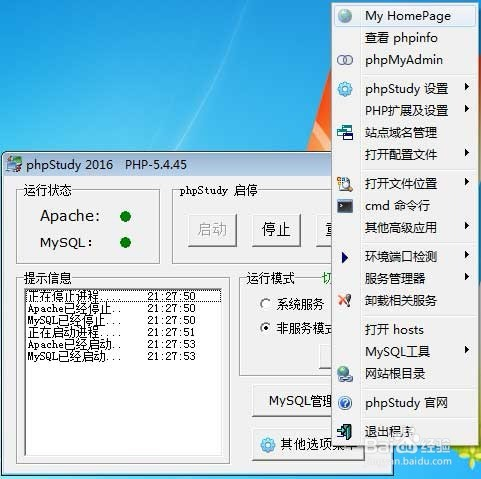
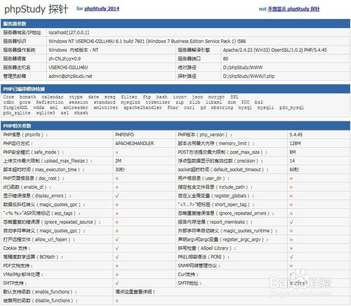

# phpstudy下载、安装、配置、网站部署、卸载
phpstudy是一个集成的php服务器程序，包含了apache、php、mysql。一键安装，无需过多配置.

## 1 下载
首先，在浏览器中打开phpstudy官网，http://www.phpstudy.net/，在页面中下载安装程序。也可以直接百度下载。

## 2 安装
1. 下载后的程序是一个zip格式的压缩包。其中的 phpStudy20161103.exe 就是安装程序，解压出来，双击安装。

2. 安装程序启动之后，会弹出一个对话框，提示安装到哪个目录；默认的安装目录是 D:\phpStudy ；可以自己修改；

3. 点击确定按钮，程序就会开始安装。

安装完成后，会在浏览器中打开 phpstudy 的官网。

安装后会在桌面生成两个快捷方式，分别是 phpStudy启动程序 和 使用手册。

在资源管理器中打开安装目录 D:\phpStudy ，可以看到已经安装的文件。

WWW 是默认的网站根目录。

phpStudy.exe 是启动程序。

manual.chm 是官方使用手册。

## 3 启动
1. 安装完成后，会自动启动phpStudy，弹出一个对话框，提示我们进行初始化，点击“是”；

2. 然后，就会弹出 phpStudy 的主界面。

程序会自动启动 Apache 和 MySQL 服务。

当看到 Apache 和 MySQL 文字后面红色的圆点变成绿色时，就表示服务启动成功了。

如果 Apache 服务启动不成功，可能是你在电脑上安装了其他WEB服务器程序（如：IIS），默认端口80被占用了。

3. 然后，点击右下角的“其他选项菜单”按钮，选择“My HomePage”，在浏览器中打开默认的网站首页。

默认的网站首页，显示的是php探针，显示了服务器上支持的php模块的详细信息。

这个页面对应的是 D:\phpStudy\WWW\l.php 文件。

## 修改默认主页
1. 打开默认的网站根目录 D:\phpStudy\WWW ；右键，新建，文本文档，双击打开；

文件内容输入

<?php

    echo "你好！";

文件，另存为；

在弹出的对话框中输入文件名 index.php ，文件类型选择“所有文件”；点击保存。

2. 在 phpStudy 主界面，点击右下角的“其他选项菜单”按钮，选择“My HomePage”，就可以看到打开的浏览器中显示了刚才新建的 index.php 文件内容“你好”；

接下来，你就可以修改index.php文件的内容，进行php代码的编写来学习php语言。

## 卸载
1. 打开任务管理器，结束以下3个任务

 - MySql.exe

 - httpd.exe

 - httpd.exe

2. 删除目录 D:\phpStudy

这样就卸载成功了！

注意卸载前，备份www目录下有用的网站文件。
https://jingyan.baidu.com/article/335530dafae53519ca41c37a.html
