Web 开发入门篇

开发 Web 系统和其他软件相比，只用 PHP 一种语言完成是不可能的，还会涉及一些和 PHP 相关的技术，需要多个 Web 构件一起配合使用才能实现。

所以在进入 PHP 领域之前一定要先了解 Web 的工作原理和各种 Web 构件的作用，以及它们是如何相互配合开发动态网站的。

更重要的是，在学习 PHP 之前一定要先学习一些关于 HTML 和 CSS 的知识，因为 PHP 是服务器端的脚本语言，必须有客户端的脚本来配合开发，其实 PHP 就是一种内嵌于 HTML 的语言。

# LAMP 网站构建(linux apache mysql php)

`wamp windows apache mysql php/python`
`lamp linux apache mysql php/python`
`lnmp linux nginx mysql php/python`

## 介绍 Web 给你认识

Web 已经人尽皆知，在网页设计中我们称为网页。

网页组成了网站，网站也是软件，隶属于 B/S（浏览器/服务器）结构的 Web 系统开发类型。

建站也属于程序员的工作，据统计已有 60%以上的程序员从事 Web 软件开发。

Web 的特点如下。

1．图形化
2．与平台无关
3．分布式的
4．动态的
5．交互的

### Web 应用的优势

Web 应用程序也是 B/S 结构的系统，B/S 是 Browser/Server 的缩写，即浏览器和服务器结构。
在客户机上只需要启动一个浏览器即可, Web 应用的优势其实也是 B/S 结构相比 C/S 结构的优势。
C/S 是 Client/Server 的缩写，即大家熟知的客户机和服务器结构
像我们常用的 QQ 或 PPS 等网络软件那样，需要下载并安装专用的客户端软件才能运行，并且服务器端也需要特定的软件支持，并采用大型数据库系统。

|     |      |
| -------------------------------------- | --------------------------------------- |
| 图 1-1 　 C/S 结构的 QQ 客户端登录界面 | 图 1-2 　 B/S 结构的 Web 客户端登录界面 |

-   基于浏览器，具有统一的平台和 UI 体验。
-   无须安装，只要有浏览器，随时随地使用。
-   总是使用应用的最新版本，无须升级。
-   数据持久存储在云端，基本无须担心丢失。
-   新一代 Web 技术提供了更好的用户体验。

### 脚本语言

脚本语言种类繁多，一般的脚本语言的执行只与具体的解释执行器有关，所以只要系统上有相应语言的解释程序就可以做到跨平台。
常见的脚本语言有 PHP、JavaScript、VBScript、ASP、JSP、Python、Ruby...脚本语言的主要特性如下：

-   语法和结构通常比较简单。
-   学习和使用通常比较简单。
-   通常以容易修改程序的“解释”作为运行方式，而不需要“编译”。
-   程序的开发产能优于运行效能。

## 动态网站开发所需的 Web 构件

动态网站开发不同于其他的应用程序开发，它需要有多种开发技术结合在一起使用。
每种技术的功能各自独立而又相互配合才能完成一个动态网站的建立，所以需要掌握以下 Web 构件，才能满足建设一个完整动态网站的全部要求：

-   客户端 IE/Firefox/Safari 等多种浏览器。
-   超文本标记语言（HTML）。
-   层叠样式表（CSS）。
-   客户端脚本编程语言 JavaScript。
-   Web 服务器 Apache/Nginx/TomCat/IIS 等中的一种。
-   服务器端编程语言 PHP/JSP/ASP/python/ruby 等中的一种。
-   数据库管理系统 MySQL/Oracle/SQL Server/mongoDB 等中的一种。
-   linux 服务器运维了解一下


## 几种主流的 Web 应用程序平台

#### 1．ASP.NET 开发平台

#### 2．JavaEE 开发平台

#### 3．LAMP 开发平台

### 动态网站开发平台技术比较


| 性能比较 | LAMP                    | JavaEE           | ASP.NET           |
| -------- | ----------------------- | ---------------- | ----------------- |
| 运行速度 | 较快                    | 快               | 一般              |
| 开发速度 | 非常快                  | 慢               | 一般              |
| 难易程度 | 简单                    | 难               | 简单              |
| 运行平台 | Linux/UNIX/Windows 平台 | 绝大多数平台均可 | 只有 Windows 平台 |
| 扩展性   | 好                      | 好               | 较差              |
| 安全性   | 好                      | 好               | 较差              |
| 应用程度 | 较广                    | 较广             | 目前一般          |
| 建设成本 | 非常低                  | 非常高           | 高                |


## 什么是URL

统一资源定位符

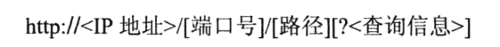


`https://www.baidu.com:443/index.php?tn=06074089_11_pg&key=value`


## web工作原理

客户端请求服务器过程

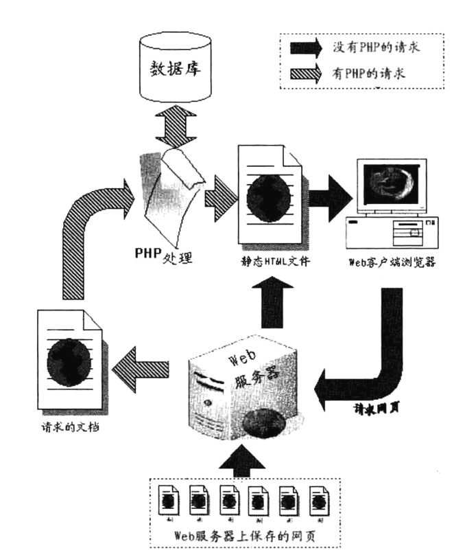

客户端访问服务器端的 HTML 文件过程

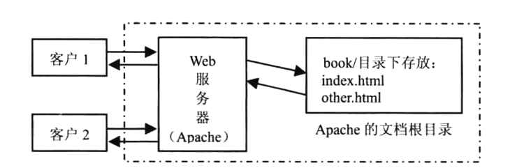

客户端访问服务器端的 PHP 文件过程

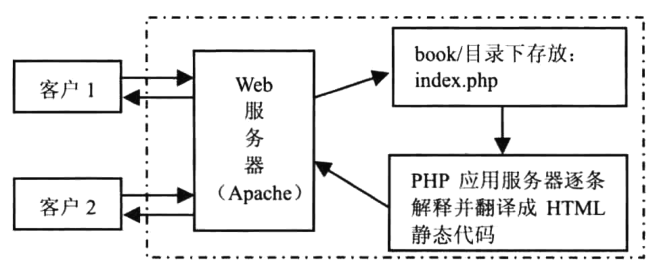

客户端访问服务器端的 MySQL 数据库过程

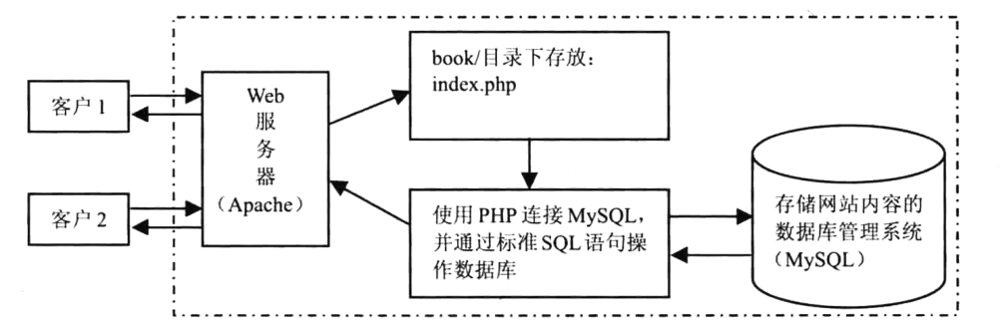


## http状态码

* **301**—永久移动。被请求的资源已被永久移动位置；
* **302**—请求的资源现在临时从不同的 URI 响应请求；
* **305**—使用代理。被请求的资源必须通过指定的代理才能被访问；
* **307**—临时跳转。被请求的资源在临时从不同的URL响应请求；
* **400**—错误请求；
* **402**—需要付款。该状态码是为了将来可能的需求而预留的，用于一些数字货币或者是微支付；
* **403**—禁止访问。服务器已经理解请求，但是拒绝执行它；
* **404**—找不到对象。请求失败，资源不存在；
* **406**—不可接受的。请求的资源的内容特性无法满足请求头中的条件，因而无法生成响应实体；

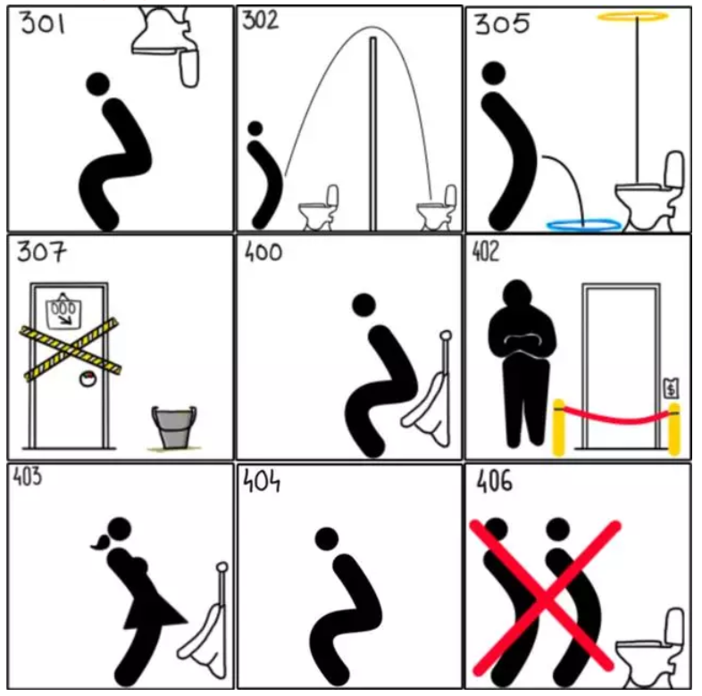

* **408**—请求超时；
* **409**—冲突。由于和被请求的资源的当前状态之间存在冲突，请求无法完成；
* **410**—遗失的。被请求的资源在服务器上已经不再可用，而且没有任何已知的转发地址；
* **413**—响应实体太大。服务器拒绝处理当前请求，请求超过服务器所能处理和允许的最大值。
* **417**—期望失败。在请求头 Expect 中指定的预期内容无法被服务器满足；
* **418**—我是一个茶壶。超文本咖啡罐控制协议，但是并没有被实际的HTTP服务器实现；
* **420**—方法失效。
* **422**—不可处理的实体。请求格式正确，但是由于含有语义错误，无法响应；
* **500**—服务器内部错误。服务器遇到了一个未曾预料的状况，导致了它无法完成对请求的处理；

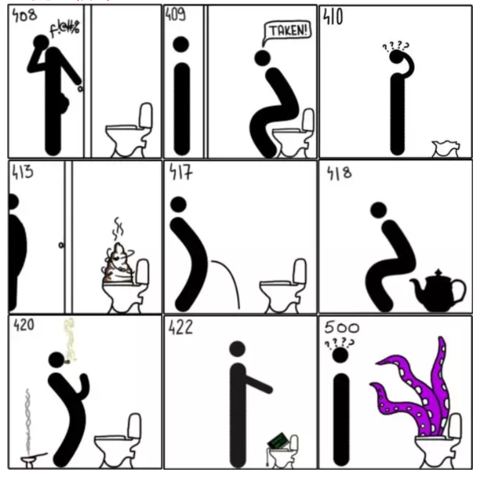


# 正式开始php

## 什么是php

> 服务器端的脚本语言
>
> PHP文件里可以写html代码


## php能干什么?

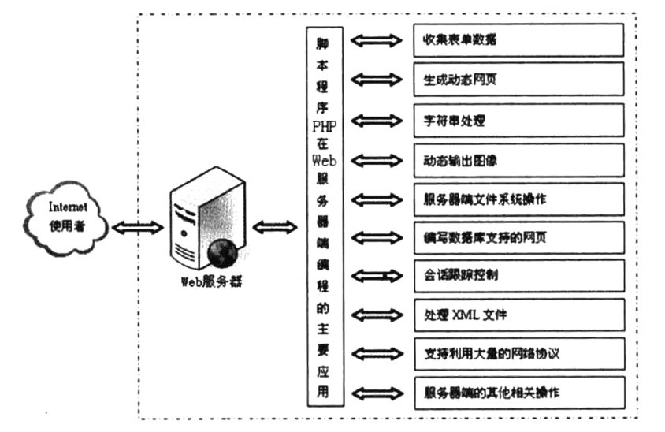


## 让PHP跑起来


开启apache, 把php解释器加入环境变量(非必须)


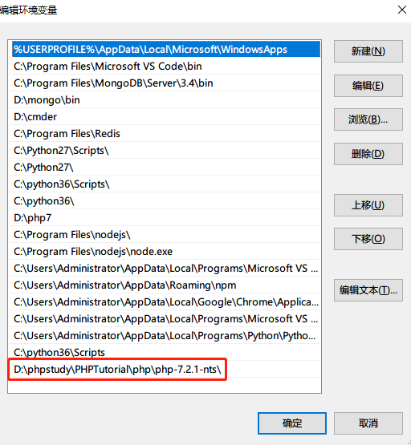


## php开始和结束标记`<?php ?>`

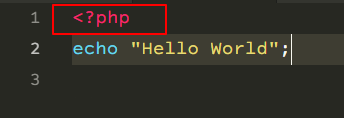

## php运行必须要加分号

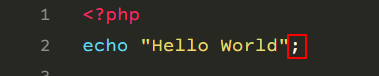


## php 注释 `//`

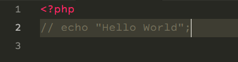


apache默认路径

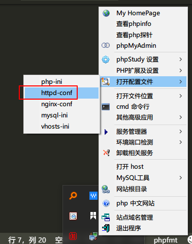

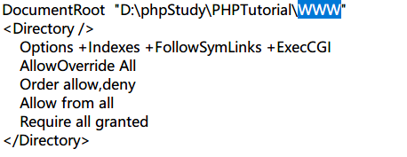


## 第一个程序 `hello world`

```php
<!DOCTYPE html>
<html lang="zh">
    <head>
        <script src="js/jquery.js"></script>
    </head>
    <body>
        hello world
    </body>
</html>
```
```php
<!DOCTYPE html>
<html lang="zh">
    <head>
        <script src="js/jquery.js"></script>
    </head>
    <body>
        <?php echo"hello world"; ?>
    </body>
</html>
```
```php
<?php
echo "hello world";

```

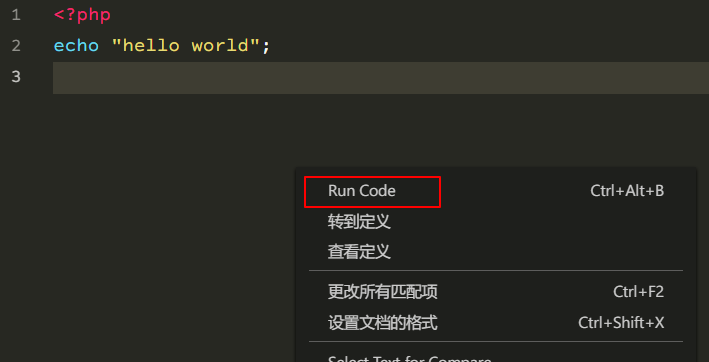


## 声明变量

php中, 变量使用`$`, 无论声明还是调用, 都需要

```php
<?php
$hello = "hello world";
echo $hello;

```

##  php不区分大小写?


变量区分大小写

关键字和函数不区分大小写

```php
<?php
$str = "hello world";
$STR = "HELLO WORLD";
echo $str."\n"; 
ECHO $STR."\n"; 
VAR_DUMP($str);

function hello(){
    echo "hello world";
}
HELLO();
```


## 变量命名规则

> 字母数字下划线, 不能以数字开头
>
> 不能使用关键字

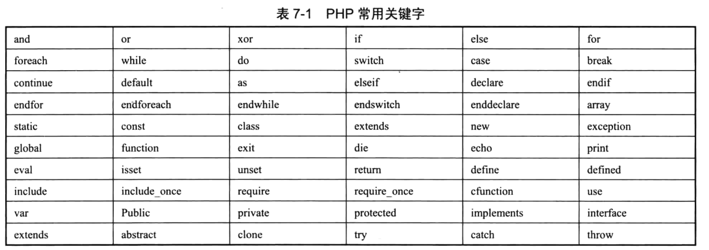


## 可变变量

> 变量的名字, 可以动态的配置和使用

```php
<?php
$hi = "hello";
$$hi = "world";
echo $hello;
```


## 变量的引用赋值


> 一个消失, 另一个依然存在

```php
<?php
$a = "hello";
$b = $a;
echo $b;
$a = "world";
echo $b;

```


```php
<?php
$a = "hello";
$b = &$a;
echo $b;
$a = "world";
echo $b;

```

```php
<?php
$a = "hello";
$b = $a;
echo $b;
unset($a);
echo $b;

```


## 变量的作用域

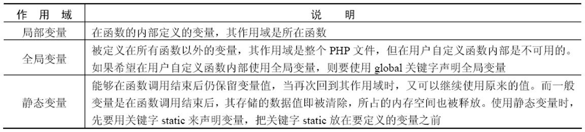

> 函数内的变量, 函数外不可用, 函数外的变量, 函数内不可以用
>
> 函数内要想使用函数外的变量, 需要加`global`

```php
<?php
$a = "hello";
function hello(){
    global $a; // 函数内要想使用函数外的变量, 需要加global
    echo $a;
}
hello();
```

函数外也可以使用函数内的变量

```php
<?php

function hello(){
    global $a;
    $a = 123;
}
hello();
echo $a;
```


静态变量在很多地方都能用到。

例如，在博客中使用静态变量记录浏览者的人数

```php
<?php
function show(){
    static $time = 0;
    echo "hello\n";
    $time++;
    echo $time."\n";
}
show();
show();
show();
show();
show();
show();
show();
```

#### php预定义变量

PHP还提供了很多非常实用的预定义变量，通过这些预定义变量可以获取到用户会话、用户操作系统的环境和本地操作系统的环境等信息。

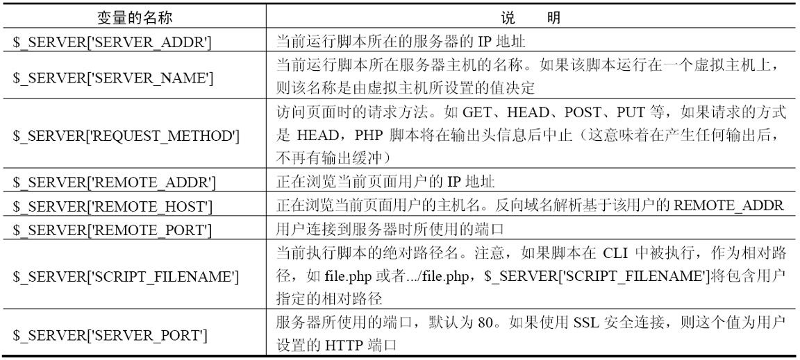

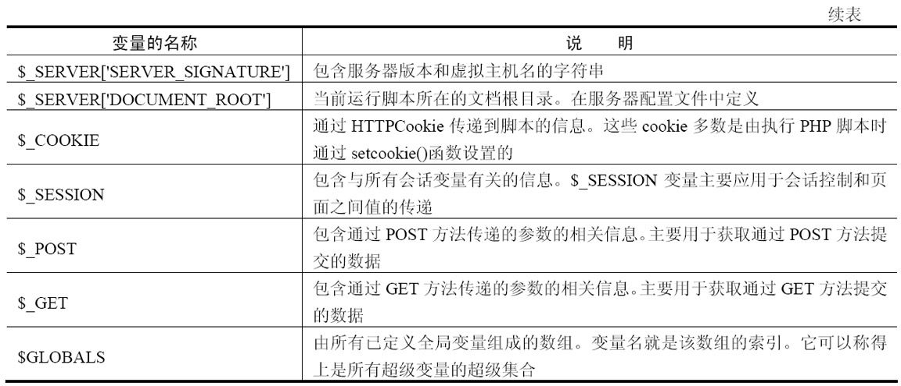


# php变量的数据类型

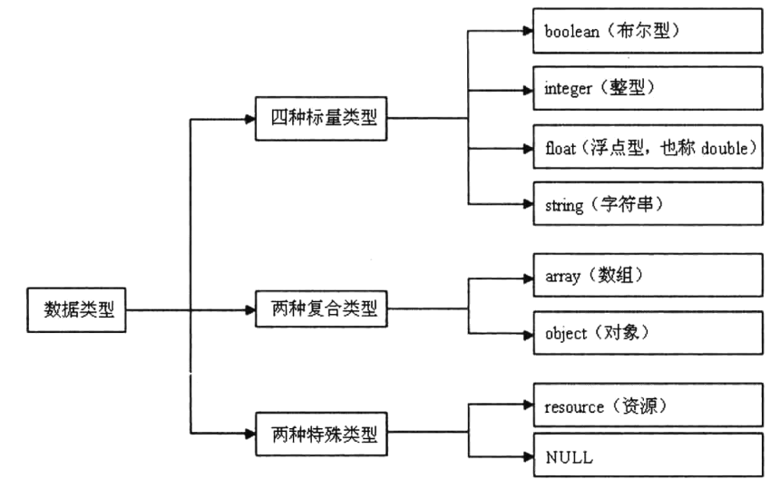


## 使用`var_dump`函数, 可以查看数据类型

```php
<?php
var_dump("123");
var_dump(123);
var_dump(123.00);
var_dump(null);
var_dump(NULL);
var_dump([1,2,3]);


$arr = [
    "name"=>"yunhe",
    "sex"=>'female'
];

var_dump($arr);
class Person{
    
}
$obj = new Person; // new 一个对象
var_dump($obj);
```


#### 先说说标量


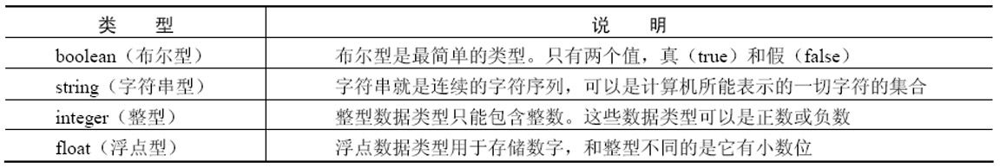


字符串类型

单双引号的区别

> 双引号中所包含的变量会自动被替换成实际数值，而单引号中包含的变量则按普通字符串输出。

```php
<?php

$a = "hello ";
echo $a."world";
```


```php
<?php

$a = "hello ";
echo "$a world";
```

```php
<?php

$a = "hello ";
echo "$aworld"; // 会把$aworld当成一个
```

```php
<?php

$a = "hello ";
echo "{$a}world";
```


在定义简单的字符串时，使用单引号是一个更加合适的处理方式。如果使用双引号，PHP将花费一些时间来处理字符串的转义和变量的解析。因此，在定义字符串时，**如果没有特别的要求，应尽量使用单引号**。


#### 浮点型

> 浮点型的数值只是一个近似值，所以要尽量避免浮点型数值之间比较大小，因为最后的结果往往是不准确的。


### 复合数据类型

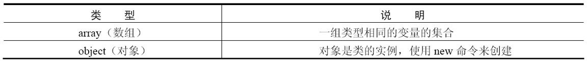

#### 数组

数组是一组数据的集合，它把一系列数据组织起来，形成一个可操作的整体。

数组中可以包括很多数据，如标量数据、数组、对象、资源以及PHP中支持的其他语法结构等。

数组中的每个数据称为一个元素，元素包括索引（键名）和值两个部分。

元素的索引可以由数字或字符串组成，元素的值可以是多种数据类型。定义数组的语法格式如下

`php索引数组 == js的数组` `php关联数组 == js的对象`

`$array = ('value1',' value2 '……)`

```php
<?php

$a = [];
$a[0] = "hello";
var_dump($a);
```

```php
<?php

$a = array();
$a[0] = "hello";
var_dump($a);
```

```php
<?php

$a = array(1,2,3,4);
var_dump($a);
```

```php
<?php

$a = array('name'=>'yunhe');
var_dump($a);

```

```php
<?php

$a = [];

$a['name'] = "yunhe";

var_dump($a);

```


或

`$array[key] = 'value'`

或

`$array = array(key1 => value1, key2 => value2……)`

或

`$array = []`


## 对象

```php
<?php
class Person{
    var $name;
    function say(){
        echo "hello world";
    }
}

$p = new Person;
$p->name = "tom";
$p->say();
```


## 特殊数据类型

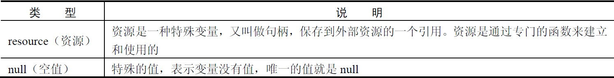


#### null

空值，顾名思义，表示没有为该变量设置任何值。

另外，空值（null）不区分大小写，null和NULL效果是一样的。

被赋予空值的情况有以下3种：还没有赋任何值、被赋值null、被unset()函数处理过的变量。

> is_null()函数用来判断变量是否为null，该函数返回一个boolean型，如果变量为null，则返回true，否则返回false。unset()函数用来销毁指定的变量。

unset

```php
<?php

$a = 123;
var_dump($a);
unset($a);
var_dump($a);
```

```php
<?php

$a = 123;
var_dump($a);
$a = null;
var_dump($a);

```

```php
<?php
$a;
var_dump($a);
var_dump(is_null($a));

```


## 数据类型转换

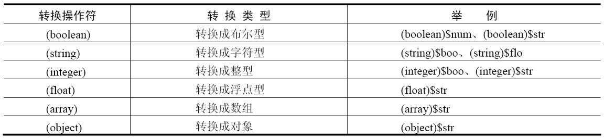

```php
<?php
$a = 123;
var_dump($a);

var_dump((string)$a);
var_dump((float)$a);
var_dump((array)$a);
var_dump((object)$a);
```


在进行类型转换的过程中应该注意以下内容：

转换成boolean型时，null、0和未赋值的变量或空数组会被转换为false，其他的为true；

```php
<?php
$a;
var_dump((boolean)$a); // false
var_dump((boolean)[]); // false
var_dump((boolean)null); // false
var_dump((boolean)0); // false
var_dump((boolean)''); // false
var_dump((boolean)'0'); // false
var_dump((boolean)0.0); // false
var_dump((boolean)'0.0'); // true
```


转换成整型时，布尔型的false转换为0，true转换为1，浮点型的小数部分被舍去，字符型如果以数字开头就截取到非数字位，否则输出0。

```php
<?php
$a = "123hello";
var_dump((int)$a); // 123
$a = "hello123";
var_dump((int)$a); // 0

```


类型转换还可以通过`settype()`函数来完成，该函数可以将指定的变量转换成指定的数据类型。

`bool settype(mixed var, string type)`

参数var为指定的变量；

参数type为指定的数据类型。

参数type有7个可选值，即boolean、float、integer、array、null、object和string。

如果转换成功则`settype()`函数返回true，否则返回false

```php
<?php
$a = "123hello";
$b = settype($a,'integer');
var_dump($b); // boolean true
var_dump($a); // int 123

```


当字符串转换为整型或浮点型时，如果字符串是以数字开头的，就会先把数字部分转换为整型，再舍去后面的字符串；

如果数字中含有小数点，则会取到小数点前一位(int)。

```php
<?php
$a = "123.11hello";
$b = settype($a,'float');
var_dump($b); // boolean true
var_dump($a); // float 123.11
```


## 检测数据类型


PHP还内置了检测数据类型的系列函数，可以对不同类型的数据进行检测，判断其是否属于某个类型，如果符合则返回true，否则返回false。


> is_numeric 不仅可以判断整数和浮点数, 也可以判断全是数字的字符串

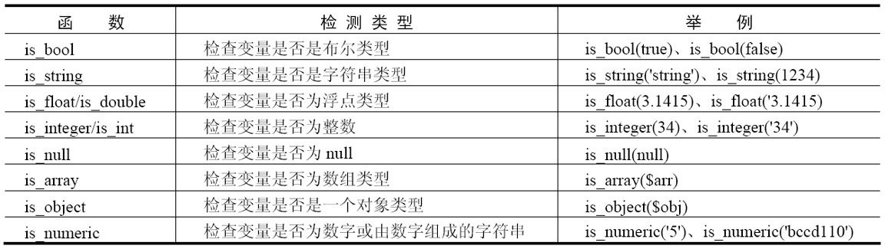

```php
<?php
$a = "123.11hello";
var_dump(is_string($a)); // true
$b = 123;
var_dump(is_numeric($b)); // true
var_dump(is_integer($b)); // true
var_dump(is_int($b)); // true

$c = 123.11;
var_dump(is_numeric($c)); // true
var_dump(is_float($c)); // true

$d = [];
var_dump(is_array($d)); // true

$e = "555";
var_dump(is_int($e));
var_dump(is_numeric($e)); // true 


```


## php常量


常量可以理解为值不变的量。

常量值被定义后，在脚本的其他任何地方都不能改变。

一个常量由英文字母、下划线和数字组成，但数字不能作为首字母出现。

在PHP中使用define()函数来定义常量，该函数的语法格式为：

`define(string constant_name,mixed value,case_sensitive=true)`


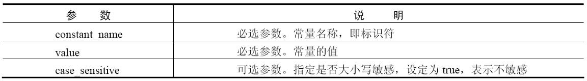


获取常量的值有两种方法：

一种是使用常量名直接获取值；

另一种是使用constant()函数，

constant()函数和直接使用常量名输出的效果是一样的，但函数可以动态地输出不同的常量，在使用上要灵活方便得多。

函数的语法格式为：

`mixed constant(string const_name)`

```php
<?php
define('HELLO', "hello world", true);

constant("HELLO");

```


要判断一个常量是否已经定义，可以使用defined()函数。

函数的语法格式为：

`bool defined(string constant_name);`


```php
<?php
define('HELLO', "hello world", true);

var_dump(defined('HELLO'));
```


参数`constant_name`为要获取常量的名称，成功则返回true，否则返回false。


## 预定义常量


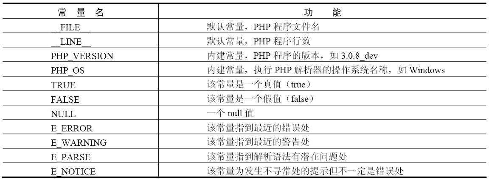

> __FILE__和__LINE__中的“__”是两条下划线，而不是一条“_”。


# PHP运算符

## 算数运算符

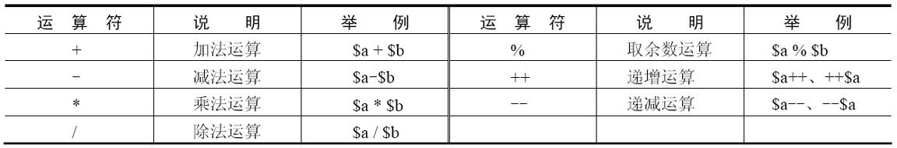

## 字符串运算符

字符串运算符只有一个，即英文的句号“.”。它的作用是将两个字符串连接起来，结合成一个新的字符串。

注意，PHP中的“+”号只用作算术运算符使用，而不能用作字符串运算符


## 赋值运算符

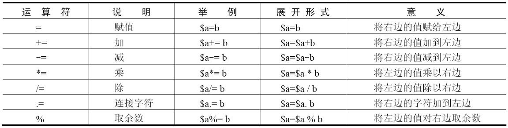

## 位运算符

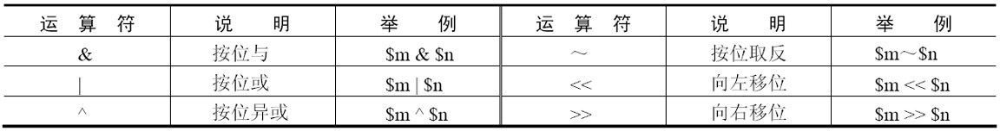

## 逻辑运算符

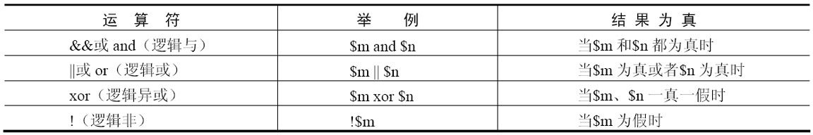

## 比较运算符

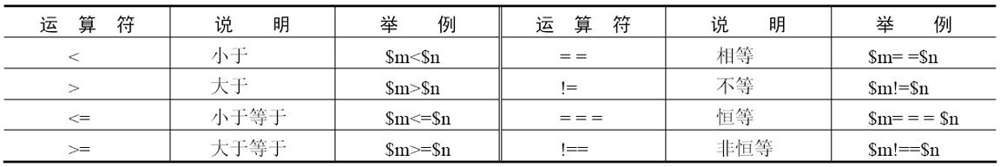

>  xor 一样==> false 不一样==>true

## 错误控制运算符


错误控制运算符可以对程序中出现错误的表达式进行操作，进而对错误信息进行屏蔽，其使用的方法就是在错误的表达式前加上@即可。

@只是对错误信息进行屏蔽，并没有真正解决错误。

经常在程序中使用的某些函数出现一些不必要（不影响程序运行）的错误信息时，使用该运算符进行屏蔽。

而对程序中的一些影响程序运行的错误，使用它不是解决问题的根本办法，不推荐使用。

```php
<?php
$err = 5/0;
```


```php
<?php
@$err = 5/0;
```


## 三元运算符

三元运算符（?:），也称为三目运算符，其作用是根据一个表达式在另两个表达式中选择一个，而不是用来在两个语句或者程序中选择。三元运算符最好放在括号中使用


```php
<?php
$value = 100; //声明一个整型变量
echo ($value == true) ? '三元运算' : '没有该值'; //对整型变量进行判断

```


## 运算符的优先顺序和结合规则

> 优先级高的操作先执行，优先级低的操作后执行，同一优先级的操作按照从左到右的顺序进行。


| 结合方向 | 运算符                                                       | 附加信息                                                     |
| -------- | ------------------------------------------------------------ | ------------------------------------------------------------ |
| 无       | clone new                                                    | [clone](http://php.net/manual/zh/language.oop5.cloning.php) 和 [new](http://php.net/manual/zh/language.oop5.basic.php#language.oop5.basic.new) |
| 左       | *[*                                                          | [array()](http://php.net/manual/zh/function.array.php)       |
| 右       | **\**                                                        | [算术运算符](http://php.net/manual/zh/language.operators.arithmetic.php) |
| 右       | *++* *--* *~* *(int)* *(float)* *(string)* *(array)* *(object)* *(bool)* *@* | [类型](http://php.net/manual/zh/language.types.php)和[递增／递减](http://php.net/manual/zh/language.operators.increment.php) |
| 无       | *instanceof*                                                 | [类型](http://php.net/manual/zh/language.types.php)          |
| 右       | *!*                                                          | [逻辑运算符](http://php.net/manual/zh/language.operators.logical.php) |
| 左       | *** */* *%*                                                  | [算术运算符](http://php.net/manual/zh/language.operators.arithmetic.php) |
| 左       | *+* *-* *.*                                                  | [算术运算符](http://php.net/manual/zh/language.operators.arithmetic.php)和[字符串运算符](http://php.net/manual/zh/language.operators.string.php) |
| 左       | *<<* *>>*                                                    | [位运算符](http://php.net/manual/zh/language.operators.bitwise.php) |
| 无       | *<* *<=* *>* *>=*                                            | [比较运算符](http://php.net/manual/zh/language.operators.comparison.php) |
| 无       | *==* *!=* *===* *!==* *<>* *<=>*                             | [比较运算符](http://php.net/manual/zh/language.operators.comparison.php) |
| 左       | *&*                                                          | [位运算符](http://php.net/manual/zh/language.operators.bitwise.php)和[引用](http://php.net/manual/zh/language.references.php) |
| 左       | *^*                                                          | [位运算符](http://php.net/manual/zh/language.operators.bitwise.php) |
| 左       | *\|*                                                         | [位运算符](http://php.net/manual/zh/language.operators.bitwise.php) |
| 左       | *&&*                                                         | [逻辑运算符](http://php.net/manual/zh/language.operators.logical.php) |
| 左       | *\|\|*                                                       | [逻辑运算符](http://php.net/manual/zh/language.operators.logical.php) |
| 左       | *??*                                                         | [比较运算符](http://php.net/manual/zh/language.operators.comparison.php) |
| 左       | *? :*                                                        | [ternary](http://php.net/manual/zh/language.operators.comparison.php#language.operators.comparison.ternary) |
| right    | *=* *+=* *-=* **=* **\*=* */=* *.=* *%=* *&=* *\|=* *^=* *<<=* *>>=* | [赋值运算符](http://php.net/manual/zh/language.operators.assignment.php) |
| 左       | *and*                                                        | [逻辑运算符](http://php.net/manual/zh/language.operators.logical.php) |
| 左       | *xor*                                                        | [逻辑运算符](http://php.net/manual/zh/language.operators.logical.php) |
| 左       | *or*                                                         | [逻辑运算符](http://php.net/manual/zh/language.operators.logical.php) |

> 如果想都记住是不太现实的，也没有必要。如果写的表达式很复杂，而且包含了较多的运算符，不妨多使用括号

` $a and (($b != $c) or (5 * (50 – $d)))`


注意`or`和`=`的优先级

```php
<?php
$a = false or true;
var_dump($a);
```


## PHP表达式

表达式是 PHP 最重要的基石。

在 PHP 中，几乎所写的任何东西都是一个表达式。

简单但却最精确的定义一个表达式的方式就是“任何有值的东西”。

