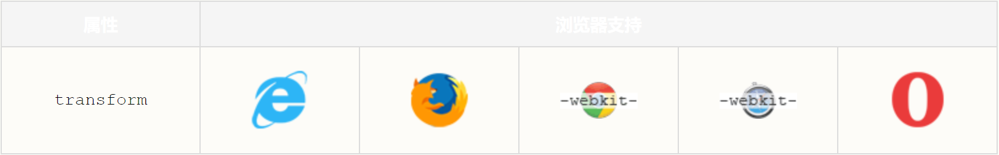

# css3 2d转换

## CSS3 转换

通过 CSS3 转换，我们能够对元素进行移动、缩放、转动、拉长或拉伸。
***
## 它如何工作？

转换是使元素改变形状、尺寸和位置的一种效果。

您可以使用 2D 或 3D 转换来转换您的元素。
***
## 浏览器支持


Internet Explorer 10、Firefox 以及 Opera 支持 transform 属性。

Chrome 和 Safari 需要前缀 -webkit-。

**注释：** Internet Explorer 9 需要前缀 -ms-。
***
## 2D 转换

在本章中，您将学到如下 2D 转换方法：

- translate()
- rotate()
- scale()
- skew()
- matrix()
  
您将在下一章学习 3D 转换。

**实例**
```
div {
    transform: rotate(30deg);
    -ms-transform: rotate(30deg);		/* IE 9 */
    -webkit-transform: rotate(30deg);	/* Safari and Chrome */
    -o-transform: rotate(30deg);		/* Opera */
    -moz-transform: rotate(30deg);		/* Firefox */
}
```
## translate() 方法

通过 translate() 方法，元素从其当前位置移动，根据给定的 left（x 坐标） 和 top（y 坐标） 位置参数：

**实例**
```
div {
    transform: translate(50px,100px);
    -ms-transform: translate(50px,100px);		/* IE 9 */
    -webkit-transform: translate(50px,100px);	/* Safari and Chrome */
    -o-transform: translate(50px,100px);		/* Opera */
    -moz-transform: translate(50px,100px);		/* Firefox */
}
```
值 translate(50px,100px) 把元素从左侧移动 50 像素，从顶端移动 100 像素。
***

## rotate() 方法

通过 rotate() 方法，元素顺时针旋转给定的角度。允许负值，元素将逆时针旋转。

**实例**
```
div {
    transform: rotate(30deg);
    -ms-transform: rotate(30deg);		/* IE 9 */
    -webkit-transform: rotate(30deg);	/* Safari and Chrome */
    -o-transform: rotate(30deg);		/* Opera */
    -moz-transform: rotate(30deg);		/* Firefox */
}
```
值 rotate(30deg) 把元素顺时针旋转 30 度。
***

## scale() 方法

通过 scale() 方法，元素的尺寸会增加或减少，根据给定的宽度（X 轴）和高度（Y 轴）参数：

**实例**
```
div {
    transform: scale(2,4);
    -ms-transform: scale(2,4);	/* IE 9 */
    -webkit-transform: scale(2,4);	/* Safari 和 Chrome */
    -o-transform: scale(2,4);	/* Opera */
    -moz-transform: scale(2,4);	/* Firefox */
}
```
值 scale(2,4) 把宽度转换为原始尺寸的 2 倍，把高度转换为原始高度的 4 倍。
***

## skew() 方法

通过 skew() 方法，元素翻转给定的角度，根据给定的水平线（X 轴）和垂直线（Y 轴）参数：

**实例**
```
div {
    transform: skew(30deg,20deg);
    -ms-transform: skew(30deg,20deg);	/* IE 9 */
    -webkit-transform: skew(30deg,20deg);	/* Safari and Chrome */
    -o-transform: skew(30deg,20deg);	/* Opera */
    -moz-transform: skew(30deg,20deg);	/* Firefox */
}
```
值 skew(30deg,20deg) 围绕 X 轴把元素翻转 30 度，围绕 Y 轴翻转 20 度。
***

## matrix() 方法
matrix() 方法把所有 2D 转换方法组合在一起。

matrix() 方法需要六个参数，包含数学函数，允许您：旋转、缩放、移动以及倾斜元素。

**实例**

如何使用 matrix 方法将 div 元素旋转 30 度：
```
div {
    transform:matrix(0.866,0.5,-0.5,0.866,0,0);
    -ms-transform:matrix(0.866,0.5,-0.5,0.866,0,0);		/* IE 9 */
    -moz-transform:matrix(0.866,0.5,-0.5,0.866,0,0);	/* Firefox */
    -webkit-transform:matrix(0.866,0.5,-0.5,0.866,0,0);	/* Safari and Chrome */
    -o-transform:matrix(0.866,0.5,-0.5,0.866,0,0);		/* Opera */
}
```
## 新的转换属性

下面的表格列出了所有的转换属性：
属性|描述|CSS
--|:--:|--:
transform | 向元素应用 2D 或 3D 转换。|3 
transform-origin | 允许你改变被转换元素的位置。|3 

***
## 2D Transform 方法

函数|描述
--|--:
matrix(n,n,n,n,n,n)	| 定义 2D 转换，使用六个值的矩阵。
translate(x,y) | 定义 2D 转换，沿着 X 和 Y 轴移动元素。
translateX(n) | 定义 2D 转换，沿着 X 轴移动元素。
translateY(n) |	定义 2D 转换，沿着 Y 轴移动元素。
scale(x,y) | 定义 2D 缩放转换，改变元素的宽度和高度。
scaleX(n) | 定义 2D 缩放转换，改变元素的宽度。
scaleY(n) | 定义 2D 缩放转换，改变元素的高度。
rotate(angle) | 定义 2D 旋转，在参数中规定角度。
skew(x-angle,y-angle) | 定义 2D 倾斜转换，沿着 X 和 Y 轴。
skewX(angle) | 定义 2D 倾斜转换，沿着 X 轴。
skewY(angle) | 定义 2D 倾斜转换，沿着 Y 轴。
