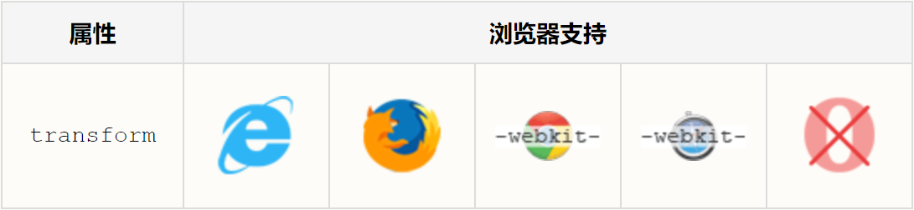

# css3 3d转换
##3D 转换

CSS3 允许您使用 3D 转换来对元素进行格式化。

在本章中，您将学到其中的一些 3D 转换方法：

- rotateX()
- rotateY()
***
## 它如何工作？

转换是使元素改变形状、尺寸和位置的一种效果。

您可以使用 2D 或 3D 转换来转换您的元素。
***
## 浏览器支持


Internet Explorer 10 和 Firefox 支持 3D 转换。

Chrome 和 Safari 需要前缀 -webkit-。

Opera 仍然不支持 3D 转换（它只支持 2D 转换）。
***
## rotateX() 方法

通过 rotateX() 方法，元素围绕其 X 轴以给定的度数进行旋转。

**实例**
```
div {
    transform: rotateX(120deg);
    -webkit-transform: rotateX(120deg);	/* Safari 和 Chrome */
    -moz-transform: rotateX(120deg);	/* Firefox */
}
```
***
## rotateY() 旋转

通过 rotateY() 方法，元素围绕其 Y 轴以给定的度数进行旋转。

**实例**
```
div {
    transform: rotateY(130deg);
    -webkit-transform: rotateY(130deg);	/* Safari 和 Chrome */
    -moz-transform: rotateY(130deg);	/* Firefox */
}
```
***
## 转换属性

下面的表格列出了所有的转换属性：

属性|描述|CSS
--|:--:|--:
transform | 向元素应用 2D 或 3D 转换。 | 3
transform-origin | 允许你改变被转换元素的位置。 | 3
transform-style | 规定被嵌套元素如何在 3D 空间中显示。 | 3
perspective | 规定 3D 元素的透视效果。 | 3
perspective-origin | 规定 3D 元素的底部位置。 | 3
backface-visibility | 定义元素在不面对屏幕时是否可见。 | 3

***
## 2D Transform 方法

函数|描述
--|--:
matrix3d(n,n,n,n,n,n,n,n,n,n,n,n,n,n,n,n) | 定义 3D 转换，使用 16 个值的 4x4 矩阵。
translate3d(x,y,z) | 定义 3D 转化。
translateX(x) | 定义 3D 转化，仅使用用于 X 轴的值。
translateY(y) | 定义 3D 转化，仅使用用于 Y 轴的值。
translateZ(z) | 定义 3D 转化，仅使用用于 Z 轴的值。
scale3d(x,y,z) | 定义 3D 缩放转换。
scaleX(x) | 定义 3D 缩放转换，通过给定一个 X 轴的值。
scaleY(y) | 定义 3D 缩放转换，通过给定一个 Y 轴的值。
scaleZ(z) | 定义 3D 缩放转换，通过给定一个 Z 轴的值。
rotate3d(x,y,z,angle) | 定义 3D 旋转。
rotateX(angle) | 定义沿 X 轴的 3D 旋转。
rotateY(angle) | 定义沿 Y 轴的 3D 旋转。
rotateZ(angle) | 定义沿 Z 轴的 3D 旋转。
perspective(n) | 定义 3D 转换元素的透视视图。