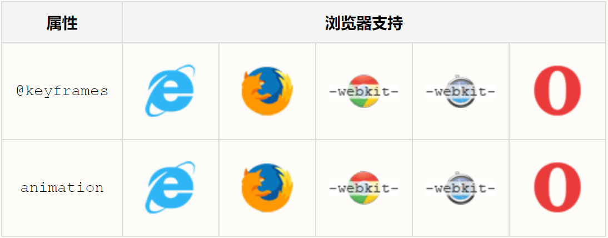

# css3动画
通过 CSS3，我们能够创建动画，这可以在许多网页中取代动画图片、Flash 动画以及 JavaScript。
***
## CSS3 @keyframes 规则
如需在 CSS3 中创建动画，您需要学习 @keyframes 规则。

@keyframes 规则用于创建动画。在 @keyframes 中规定某项 CSS 样式，就能创建由当前样式逐渐改为新样式的动画效果。
***
## 浏览器支持


Internet Explorer 10、Firefox 以及 Opera 支持 @keyframes 规则和 animation 属性。

Chrome 和 Safari 需要前缀 -webkit-。

**注释:** Internet Explorer 9，以及更早的版本，不支持 @keyframe 规则或 animation 属性。
***
**实例**
```
@keyframes myfirst
{
from {background: red;}
to {background: yellow;}
}

@-moz-keyframes myfirst /* Firefox */
{
from {background: red;}
to {background: yellow;}
}

@-webkit-keyframes myfirst /* Safari 和 Chrome */
{
from {background: red;}
to {background: yellow;}
}

@-o-keyframes myfirst /* Opera */
{
from {background: red;}
to {background: yellow;}
}
```
***
## CSS3 动画
当您在 @keyframes 中创建动画时，请把它捆绑到某个选择器，否则不会产生动画效果。

通过规定至少以下两项 CSS3 动画属性，即可将动画绑定到选择器：
- 规定动画的名称
- 规定动画的时长
  
**实例**

把 "myfirst" 动画捆绑到 div 元素，时长：5 秒：
```
div {
    animation: myfirst 5s;
    -moz-animation: myfirst 5s;	/* Firefox */
    -webkit-animation: myfirst 5s;	/* Safari 和 Chrome */
    -o-animation: myfirst 5s;	/* Opera */
}
```
**注释：** 您必须定义动画的名称和时长。如果忽略时长，则动画不会允许，因为默认值是 0。
***
## 什么是 CSS3 中的动画？
动画是使元素从一种样式逐渐变化为另一种样式的效果。

您可以改变任意多的样式任意多的次数。

请用百分比来规定变化发生的时间，或用关键词 "from" 和 "to"，等同于 0% 和 100%。

0% 是动画的开始，100% 是动画的完成。

为了得到最佳的浏览器支持，您应该始终定义 0% 和 100% 选择器。

**实例**

当动画为 25% 及 50% 时改变背景色，然后当动画 100% 完成时再次改变：
```
@keyframes myfirst
{
0%   {background: red;}
25%  {background: yellow;}
50%  {background: blue;}
100% {background: green;}
}

@-moz-keyframes myfirst /* Firefox */
{
0%   {background: red;}
25%  {background: yellow;}
50%  {background: blue;}
100% {background: green;}
}

@-webkit-keyframes myfirst /* Safari 和 Chrome */
{
0%   {background: red;}
25%  {background: yellow;}
50%  {background: blue;}
100% {background: green;}
}

@-o-keyframes myfirst /* Opera */
{
0%   {background: red;}
25%  {background: yellow;}
50%  {background: blue;}
100% {background: green;}
}
```
**实例**

改变背景色和位置：
```
@keyframes myfirst
{
0%   {background: red; left:0px; top:0px;}
25%  {background: yellow; left:200px; top:0px;}
50%  {background: blue; left:200px; top:200px;}
75%  {background: green; left:0px; top:200px;}
100% {background: red; left:0px; top:0px;}
}

@-moz-keyframes myfirst /* Firefox */
{
0%   {background: red; left:0px; top:0px;}
25%  {background: yellow; left:200px; top:0px;}
50%  {background: blue; left:200px; top:200px;}
75%  {background: green; left:0px; top:200px;}
100% {background: red; left:0px; top:0px;}
}

@-webkit-keyframes myfirst /* Safari 和 Chrome */
{
0%   {background: red; left:0px; top:0px;}
25%  {background: yellow; left:200px; top:0px;}
50%  {background: blue; left:200px; top:200px;}
75%  {background: green; left:0px; top:200px;}
100% {background: red; left:0px; top:0px;}
}

@-o-keyframes myfirst /* Opera */
{
0%   {background: red; left:0px; top:0px;}
25%  {background: yellow; left:200px; top:0px;}
50%  {background: blue; left:200px; top:200px;}
75%  {background: green; left:0px; top:200px;}
100% {background: red; left:0px; top:0px;}
}
```
***
## CSS3 动画属性
下面的表格列出了 @keyframes 规则和所有动画属性：

属性|描述|CSS
--|:--:|--:
@keyframes| 规定动画。|3
animation| 所有动画属性的简写属性，除了 animation-play-state 属性。|3
animation-name|	规定 @keyframes 动画的名称。|3
animation-duration|	规定动画完成一个周期所花费的秒或毫秒。默认是 0。|3
animation-timing-function| 规定动画的速度曲线。默认是 "ease"。|3
animation-delay| 规定动画何时开始。默认是 0。|3
animation-iteration-count| 规定动画被播放的次数。默认是 1。|3
animation-direction| 规定动画是否在下一周期逆向地播放。默认是 "normal"。|3
animation-play-state| 规定动画是否正在运行或暂停。默认是 "running"。|3
animation-fill-mode| 规定对象动画时间之外的状态。|3

下面的两个例子设置了所有动画属性：

**实例**

运行名为 myfirst 的动画，其中设置了所有动画属性：
```
div {
    animation-name: myfirst;
    animation-duration: 5s;
    animation-timing-function: linear;
    animation-delay: 2s;
    animation-iteration-count: infinite;
    animation-direction: alternate;
    animation-play-state: running;
    /* Firefox: */
    -moz-animation-name: myfirst;
    -moz-animation-duration: 5s;
    -moz-animation-timing-function: linear;
    -moz-animation-delay: 2s;
    -moz-animation-iteration-count: infinite;
    -moz-animation-direction: alternate;
    -moz-animation-play-state: running;
    /* Safari 和 Chrome: */
    -webkit-animation-name: myfirst;
    -webkit-animation-duration: 5s;
    -webkit-animation-timing-function: linear;
    -webkit-animation-delay: 2s;
    -webkit-animation-iteration-count: infinite;
    -webkit-animation-direction: alternate;
    -webkit-animation-play-state: running;
    /* Opera: */
    -o-animation-name: myfirst;
    -o-animation-duration: 5s;
    -o-animation-timing-function: linear;
    -o-animation-delay: 2s;
    -o-animation-iteration-count: infinite;
    -o-animation-direction: alternate;
    -o-animation-play-state: running;
}
```
**实例**

与上面的动画相同，但是使用了简写的动画 animation 属性：
```
div {
    animation: myfirst 5s linear 2s infinite alternate;
    /* Firefox: */
    -moz-animation: myfirst 5s linear 2s infinite alternate;
    /* Safari 和 Chrome: */
    -webkit-animation: myfirst 5s linear 2s infinite alternate;
    /* Opera: */
    -o-animation: myfirst 5s linear 2s infinite alternate;
}
```