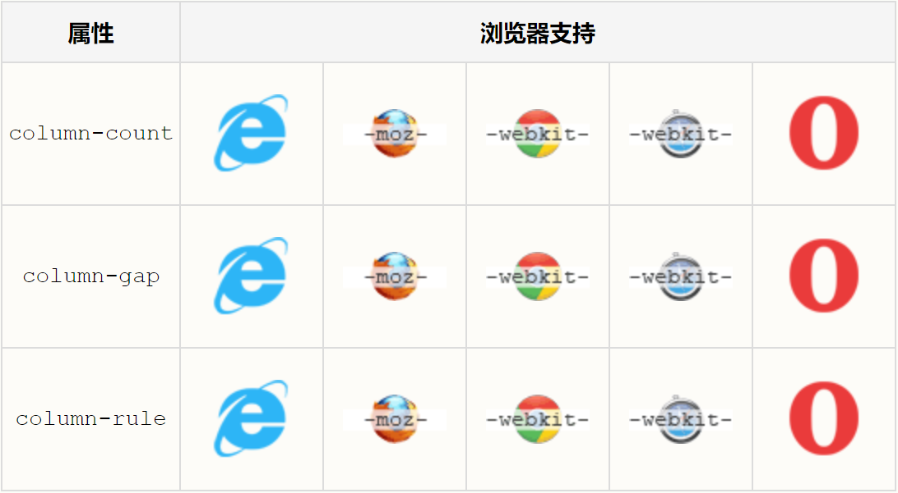

# 弹性盒子

## CSS3 多列

通过 CSS3，您能够创建多个列来对文本进行布局 - 就像报纸那样！

在本章中，您将学习如下多列属性：

- column-count
- column-gap
- column-rule
***
## 浏览器支持


Internet Explorer 10 和 Opera 支持多列属性。

Firefox 需要前缀 -moz-。

Chrome 和 Safari 需要前缀 -webkit-。

**注释：** Internet Explorer 9 以及更早的版本不支持多列属
性。
***
## CSS3 创建多列

column-count 属性规定元素应该被分隔的列数：

**实例**

把 div 元素中的文本分隔为三列：
```
div {
    -moz-column-count:3; 	/* Firefox */
    -webkit-column-count:3; /* Safari 和 Chrome */
    column-count:3;
}
```
***
## CSS3 规定列之间的间隔

column-gap 属性规定列之间的间隔：

**实例**

规定列之间 40 像素的间隔：
```
div {
    -moz-column-gap:40px;		/* Firefox */
    -webkit-column-gap:40px;	/* Safari 和 Chrome */
    column-gap:40px;
}
```
***
## CSS3 列规则

column-rule 属性设置列之间的宽度、样式和颜色规则。

**实例**

规定列之间的宽度、样式和颜色规则：
```
div {
    -moz-column-rule:3px outset #ff0000;	/* Firefox */
    -webkit-column-rule:3px outset #ff0000;	/* Safari and Chrome */
    column-rule:3px outset #ff0000;
}
```
***
## 新的多列属性

下面的表格列出了所有的转换属性：

属性|描述|CSS
--|:--:|--:
column-count | 规定元素应该被分隔的列数。 | 3
column-fill | 规定如何填充列。 | 3
column-gap | 规定列之间的间隔。 | 3
column-rule | 设置所有 column-rule-* 属性的简写属性。 | 3
column-rule-color | 规定列之间规则的颜色。 | 3
column-rule-style | 规定列之间规则的样式。 | 3
column-rule-width | 规定列之间规则的宽度。 | 3
column-span | 规定元素应该横跨的列数。 | 3
column-width | 规定列的宽度。 | 3
columns | 规定设置 column-width 和 column-count 的简写属性。 | 3
