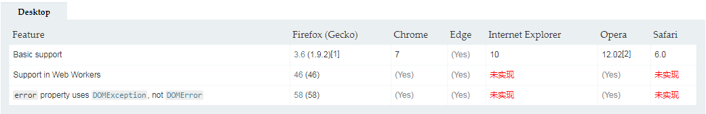

# FileReader
>FileReader对象允许Web应用程序异步读取存储在用户计算机上的文件（或原始数据缓冲区）的内容，使用 File 或 Blob 对象指定要读取的文件或数据。

>其中File对象可以是来自用户在一个input元素上选择文件后返回的FileList对象,也可以来自拖放操作生成的 DataTransfer对象,还可以是来自在一个HTMLCanvasElement上执行mozGetAsFile()方法后返回结果。

## 属性
### FileReader.error 只读
> 一个DOMException，表示在读取文件时发生的错误 。
### FileReader.readyState 只读
> 表示FileReader状态的数字。取值如下：

|常量名	|值	|描述|
|:----:|:----|----:|
|EMPTY	|0	|还没有加载任何数据.|
|LOADING	|1	|数据正在被加载.|
|DONE	|2	|已完成全部的读取请求.|

## 事件处理
### FileReader.onload
>处理load事件。该事件在读取操作完成时触发。


## 方法
### FileReader.abort()
>中止读取操作。在返回时，readyState属性为DONE。
### FileReader.readAsArrayBuffer()
>开始读取指定的 Blob中的内容, 一旦完成, result 属性中保存的将是被读取文件的 ArrayBuffer 数据对象. 
### FileReader.readAsDataURL()
> 开始读取指定的Blob中的内容。一旦完成，result属性中将包含一个data: URL格式的字符串以表示所读取文件的内容。
### FileReader.readAsText()
>开始读取指定的Blob中的内容。一旦完成，result属性中将包含一个字符串以表示所读取的文件内容。
## 兼容
Desktop


## 如何在web应用程序中使用文件
### 显示用户选择的图片的缩略图
1. 访问选择的文件
```
<input type="file" id="input">
```
> 通过文件API，我们可以访问FileList，其中FileList由代表用户所选文件的File对象组成

> 使用传统的DOM选择器访问一个被选择的文件。
```
var selectedFile = document.getElementById('input').files[0];
```
> 如果你想让用户选择多个文件，只需在input元素上使用multiple属性：
```
    <input type="file" id="fileElem" multiple accept="image/*" style="display:none" onchange="handleFiles(this.files)">
    <label for="fileElem">Select some files</label>
    <div id="preview"></div>
```
2. 文件预览
```
        function handleFiles(files) {
            for (var i = 0; i < files.length; i++) {
                var file = files[i];
                var imageType = /^image\//;

                if (!imageType.test(file.type)) {
                    continue;
                }

                var img = document.createElement("img");
                img.classList.add("obj");
                img.file = file;
                preview.appendChild(
                img); 

                var reader = new FileReader();
                reader.onload = (function (aImg) {
                    return function (e) {
                        aImg.src = e.target.result;
                    };
                })(img);
                reader.readAsDataURL(file);
            }
        }
```

# FormData 对象的使用
>FormData对象用以将数据编译成键值对，以便用XMLHttpRequest来发送数据。其主要用于发送表单数据，但亦可用于发送带键数据(keyed data)，而独立于表单使用。如果表单enctype属性设为multipart/form-data ，则会使用表单的submit()方法来发送数据，从而，发送数据具有同样形式。

1.你可以自己创建一个FormData对象，然后调用它的append()方法来添加字段，像这样：
```
var formData = new FormData();

formData.append("username", "Groucho");
formData.append("accountnum", 123456); //数字123456会被立即转换成字符串 "123456"

// HTML 文件类型input，由用户选择
formData.append("userfile", fileInputElement.files[0]);

// JavaScript file-like 对象
var content = '<a id="a"><b id="b">hey!</b></a>'; // 新文件的正文...
var blob = new Blob([content], { type: "text/xml"});

formData.append("webmasterfile", blob);

var request = new XMLHttpRequest();
request.open("POST", "http://foo.com/submitform.php");
request.send(formData);
```

2. 通过HTML表单创建FormData对象
```
var formElement = document.querySelector("form");
var request = new XMLHttpRequest();
request.open("POST", "submitform.php");
request.send(new FormData(formElement));
```

> 你还可以在创建一个包含Form表单数据的FormData对象之后和发送请求之前，附加额外的数据到FormData对象里，像这样：

```
var formElement = document.querySelector("form");
var formData = new FormData(formElement);
var request = new XMLHttpRequest();
request.open("POST", "submitform.php");
formData.append("serialnumber", serialNumber++);
request.send(formData);
```
3. 使用FormData对象上传文件
```
<form enctype="multipart/form-data" method="post" name="fileinfo">
  <label>Your email address:</label>
  <input type="email" autocomplete="on" autofocus name="userid" placeholder="email" required size="32" maxlength="64" /><br />
  <label>Custom file label:</label>
  <input type="text" name="filelabel" size="12" maxlength="32" /><br />
  <label>File to stash:</label>
  <input type="file" name="file" required />
  <input type="submit" value="Stash the file!" />
</form>
<div></div>
```
> 然后使用下面的代码发送请求：
```
var form = document.forms.namedItem("fileinfo");
form.addEventListener('submit', function(ev) {

  var oOutput = document.querySelector("div"),
      oData = new FormData(form);

  oData.append("CustomField", "This is some extra data");

  var oReq = new XMLHttpRequest();
  oReq.open("POST", "stash.php", true);
  oReq.onload = function(oEvent) {
    if (oReq.status == 200) {
      oOutput.innerHTML = "Uploaded!";
    } else {
      oOutput.innerHTML = "Error " + oReq.status + " occurred when trying to upload your file.<br \/>";
    }
  };

  oReq.send(oData);
  ev.preventDefault();
}, false);
```
3. 你也可以通过jQuery来使用FormData对象
```
var fd = new FormData(document.querySelector("form"));
fd.append("CustomField", "This is some extra data");
$.ajax({
  url: "stash.php",
  type: "POST",
  data: fd,
  processData: false,  // 不处理数据
  contentType: false   // 不设置内容类型
});
```